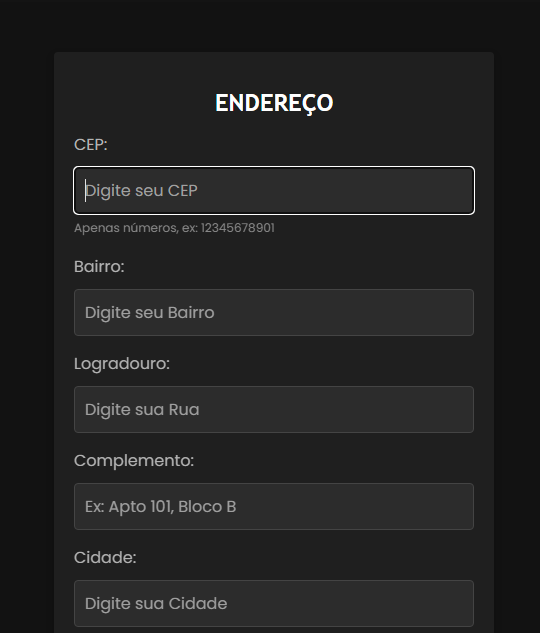

#  - Projeto cadastro de endereço com cunsumo de API (VIACEP)
Este projeto consiste em um sistema de consulta de endereço baseado no CEP (Código de Endereçamento Postal) brasileiro. O sistema faz uma requisição a uma API pública (ViaCEP) e preenche automaticamente os campos do formulário de endereço, como logradouro, bairro, cidade e estado.

 

 Aqui está um exemplo de um arquivo README bem documentado para o código JavaScript fornecido. O objetivo é explicar cada parte do código e fornecer uma visão clara do que ele faz.

---

# Projeto de Consulta de CEP

Este projeto consiste em um sistema de consulta de endereço baseado no CEP (Código de Endereçamento Postal) brasileiro. O sistema faz uma requisição a uma API pública (ViaCEP) e preenche automaticamente os campos do formulário de endereço, como logradouro, bairro, cidade e estado.

## Tecnologias Utilizadas

- **JavaScript**: Linguagem de programação utilizada para desenvolver as funções de manipulação de DOM e requisição à API.
- **ViaCEP API**: Serviço de consulta de CEPs brasileiros.
- **HTML/CSS**: Para a estrutura do formulário e estilização (não fornecido neste exemplo).

## Funcionalidades

1. **Limpeza dos Campos do Formulário**: Antes de realizar a consulta, os campos do formulário são limpos.
2. **Validação de CEP**: Verifica se o CEP inserido pelo usuário é válido, ou seja, se tem 8 dígitos e consiste apenas de números.
3. **Requisição à API ViaCEP**: Se o CEP for válido, o sistema faz uma requisição à API e retorna o endereço correspondente.
4. **Preenchimento Automático**: Os campos do formulário são preenchidos automaticamente com os dados retornados pela API, como logradouro, bairro, cidade e estado.

## Estrutura do Código

O código JavaScript está estruturado em funções para facilitar a manutenção e a compreensão.

### Modo Restrito

## Como Usar

1. O usuário insere um CEP válido no campo correspondente.
2. O sistema valida o CEP e faz a requisição à API ViaCEP.
3. Se o CEP for válido e encontrado, os campos de endereço são automaticamente preenchidos.
4. Se o CEP for inválido ou não encontrado, uma mensagem de erro será exibida.

## Observações

- **API ViaCEP**: A API utilizada é gratuita e pode ser acessada via `http://viacep.com.br/ws/`. Nenhuma chave de API é necessária para seu uso.
- **Validação de CEP**: É importante que o CEP tenha exatamente 8 dígitos e contenha apenas números para que a consulta funcione corretamente.

---

Com esse README, qualquer desenvolvedor ou usuário terá uma visão clara do propósito do código, de como ele funciona e de como utilizá-lo corretamente.

 # async
A declaração async function define uma função assíncrona, que retorna um objeto AsyncFunction.

 # focusout
O evento focusout é acionado assim que o elemento perde o foco. A principal diferença entre esse evento e o evento blur, é que esse ultimo não gera "borbulhas".

# jason
(JSON) é um formato padrão baseado em texto para representar dados estruturados com base na sintaxe de objeto JavaScript. É comumente usado para transmitir dados em aplicativos da web (por exemplo, enviar alguns dados do servidor para o cliente, para que possam ser exibidos em uma página da web, ou vice-versa). 

# fetch
A API Fetch fornece uma interface JavaScript para acessar e manipular partes do pipeline HTTP, tais como os pedidos e respostas. Ela também fornece o método global fetch() que fornece uma maneira fácil e lógica para buscar recursos de forma assíncrona através da rede.

 # await 
 A expressão await faz a execução de uma função async pausar, para esperar pelo retorno da Promise, e resume a execução da função async quando o valor da Promise é resolvido.

# 🎮Tecnologias e Fontes Utilizadas
 
HTML para a estrutura da página.
- JavaScript
 - if
  - else
  - await
  - fetch
  - jason
  - focusout
  - async
- vscode  
 

## 🚧 Fontes utilizadas/Referencias 

* [Mozilla](https://developer.mozilla.org/en-US/docs/Web/HTML/Element/form)- The Form Element.
* [Alura](https://www.alura.com.br/artigos/escrever-bom-readme)- Como Escrever um README Incrível no seu GitHub.
*  [MDN web docs](https://developer.mozilla.org/pt-BR/)

 
 # 💋AUTORES
 [ Ana Beatriz Silva.](https://github.com/biasantorii) |
| :---: